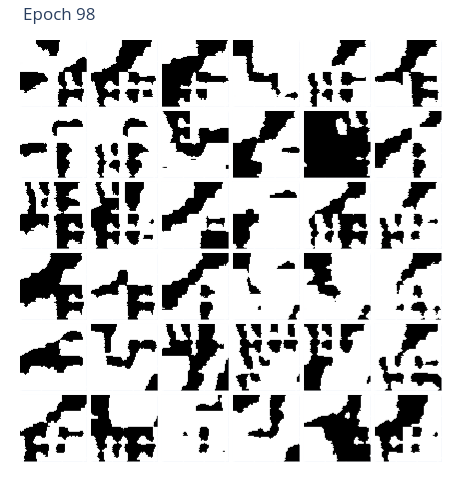
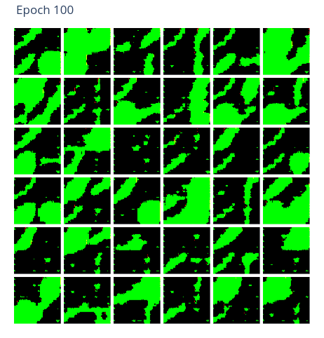

# GlyphNet

GlyphNet is an experiment in using neural networks to generate a visual language.
This project is inspired by Joel Simon's [Dimensions of Dialogue](https://www.joelsimon.net/dimensions-of-dialogue.html)
work, but all of the code here is original.

## Black and white example




## Color example




## How it works

The task is based on the Shannon-Weaver model of communication, where
the transmitter and receiver roles are played by two neural networks, G (a generator)
and D (a discriminator).


G turns a **message** into an image (**signal**) that the discriminator D tries to
decode back into the original message. The message is either a one-hot encoded
vector or a vector of binary values (ex. [0, 1, 1, 0...]). The two networks are trained
at the same time, like an autoencoder.

The task varies from a typical autoencoder because the communication channel (latent space)
is noisy. The transmitted image (**signal**) may be shifted, resized, rotated, etc. so that the
received signal differs from the original signal.

Another catch is that the communication channel becomes _increasingly_ noisy over time (this
is inspired by [Automatic Domain Randomization](https://openai.com/blog/solving-rubiks-cube/)
and [POET](https://eng.uber.com/poet-open-ended-deep-learning/)). When G and D get too 
competent within their current communication channel, the channel becomes more noisy,
encouraging the language to evolve further.

If the two neural networks are successful in communicating clearly across a noisy channel, then they've created
a visual language that is robust to many different kinds of noise, which means it probably looks cool. 😎️


## Installation

GlyphNet itself is a Python package that depends on TensorFlow 2.0. There are other requirements listed
in `requirements.txt`. You can install the package and its requirements locally with pip.

Note that some functionality (including `make_mp4.py` and model visualization) will require
more dependencies that can be installed with conda.

```
git clone https://github.com/noahtren/GlyphNet
pip install -e .
```

## Run it

The `main.py` module is used to begin training. 
It produces a visualization of progress at the end of each epoch.

Each run can use different settings which are passed
at the command line. Run `python main.py --help` for descriptions of each setting.
